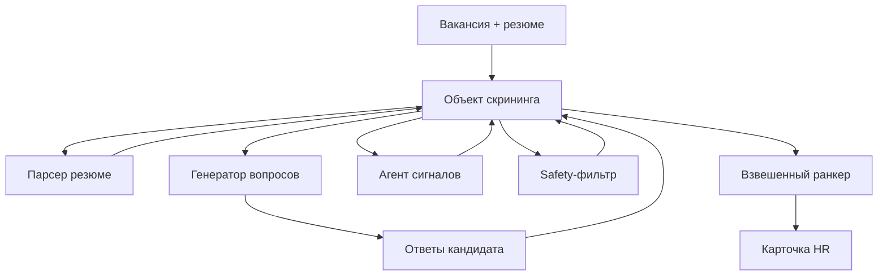

# Agentiki Screening MVP

AI-скрининг резюме для массового подбора. Кандидат загружает резюме, отвечает на 3-5 уточняющих вопросов, а HR получает объяснимую карточку: score, категорию, почему кандидат подходит и что нужно проверить.

Главная идея: LLM не решает, нанимать человека или нет. Gemini только извлекает факты и сигналы, а итоговый score считает детерминированный ранкер в коде. Финальное решение остается за HR.

## Для жюри

Проблема: при массовом подборе HR получает сотни откликов, но не успевает быстро и одинаково качественно проверить каждого кандидата. Из-за задержек теряются подходящие люди, а рекрутеры тратят время на однотипные вопросы.

Решение: система берет на себя первичный скрининг. Она парсит резюме, задает короткие уточняющие вопросы, выделяет сильные стороны и риски, а затем показывает HR объяснимую оценку кандидата.

Что важно:

- кандидат видит нейтральный и понятный процесс;
- HR видит не просто score, а причины оценки;
- модель не использует дискриминационные признаки;
- решение о приглашении принимает человек.

## Как работает



Коротко по агентам:

- **Парсер резюме** достает факты из PDF: опыт, навыки, локацию, график, пробелы.
- **Генератор вопросов** задает 3-5 вопросов по тому, чего не хватает для оценки.
- **Агент сигналов** выделяет плюсы, риски, missing info и evidence.
- **Safety-фильтр** не дает использовать возраст, пол, фото, здоровье, национальность и другие sensitive-признаки.
- **Ранкер** считает итоговый score обычной функцией по весам вакансии.

## Система оценивания

HR не настраивает десятки параметров. Для вакансии задаются только 4 понятных веса:

```json
{
  "experience": 0.25,
  "skills": 0.30,
  "schedule": 0.30,
  "motivation": 0.15
}
```

Формула:

```text
score =
  experience_weight * experience_score +
  skills_weight * skills_score +
  schedule_weight * schedule_score +
  motivation_weight * motivation_score
  - penalties
```

Внутри ранкера дополнительные сигналы не теряются:

- `communication_quality` входит в `skills`;
- `availability` и `location_match` входят в `schedule`;
- HR видит итоговый breakdown в 4 блоках: опыт, навыки, график, мотивация.

Штрафы:

```text
-3 балла за каждый риск, максимум -12
-2 балла за каждый пробел, максимум -8
```

Must-have правило:

```text
если обязательные требования не пройдены:
  finalScore <= 35
  tier = not_fit
```

Категории:

```text
85-100  top_candidate
70-84   good_match
50-69   manual_review
35-49   weak_match
0-34    not_fit
```

## Что видит HR

Итоговая карточка кандидата содержит:

- итоговый score;
- категорию кандидата;
- рекомендуемое действие;
- **почему подходит**;
- **что проверить**;
- evidence по каждому блоку скоринга;
- missing info;
- нейтральный ответ кандидату.

Пример:

```json
{
  "finalScore": 71,
  "tier": "good_match",
  "recommendedAction": "invite_to_interview",
  "topAdvantages": [
    "Есть опыт работы с клиентами",
    "Готова к сменному графику",
    "Готова обучиться работе с кассой"
  ],
  "topConcerns": [
    "Нет подтвержденного опыта работы с кассой",
    "Не до конца понятны зарплатные ожидания"
  ]
}
```

## Что реализовано

- PDF upload и извлечение текста через `pdf-parse`.
- Gemini 3 Flash для парсинга резюме, генерации вопросов и извлечения scoring-сигналов.
- Zod-валидация всех ответов Gemini.
- Детерминированный `rankCandidate(vacancy, signals)`.
- Demo vacancy: продавец-консультант / кассир.
- HR Dashboard для демо.
- Docker Compose для простого запуска.

## Запуск

```bash
npm install
cp .env.example .env
npm run dev
```

Dashboard:

```text
http://127.0.0.1:3000
```

Для Gemini:

```bash
GEMINI_API_KEY=...
GEMINI_MODEL=gemini-3-flash-preview
```

Без `GEMINI_API_KEY` приложение работает на mock/demo-логике.

## Docker Compose

Перед запуском должен быть включен Docker Desktop.

```bash
cp .env.example .env
docker compose up --build
```

Остановить:

```bash
docker compose down
```

## Команды

```bash
npm run dev   # HR dashboard + API
npm run demo  # печатает demo RankResult
npm test      # unit tests для rankCandidate
```

## API для backend

Подробная документация: [docs/API.md](docs/API.md).

Основной flow:

1. `POST /api/prepare-screening`
   - вход: `vacancy` + `pdfBase64` или `pdfText`;
   - выход: `CandidateProfile` + `ScreeningQuestion[]`.

2. `POST /api/rank-candidate`
   - вход: `vacancy` + `profile` + `questions` + `answers`;
   - выход: `CandidateSignals` + `RankResult`.

Важно: backend сохраняет `profile` и `questions` после первого шага и передает их на втором шаге. Так мы не генерируем вопросы повторно.

## Где лежит код

- `src/ml/types.ts` - TypeScript-контракты.
- `src/ml/schemas.ts` - Zod-схемы и validation guard.
- `src/ml/prompts.ts` - Gemini prompts.
- `src/ml/gemini.ts` - вызовы Gemini.
- `src/ml/ranker.ts` - система скоринга.
- `src/ml/demoData.ts` - demo-вакансия и demo-сигналы.
- `src/ml/pdf.ts` - извлечение текста из PDF.
- `src/server.ts` - API + static UI.
- `public/` - demo HR Dashboard.
- `docs/API.md` - документация для backend.

## Guardrails

- Не используем возраст, пол, фото, внешность, национальность, религию, семейное положение, здоровье и похожие protected attributes.
- Gemini извлекает факты, преимущества и риски, но не принимает решение о найме.
- Нейтральный ответ кандидату подставляется шаблоном в коде.
- Кандидату не показываются score, tier и причины ранжирования.
- Финальное решение всегда остается за HR.
